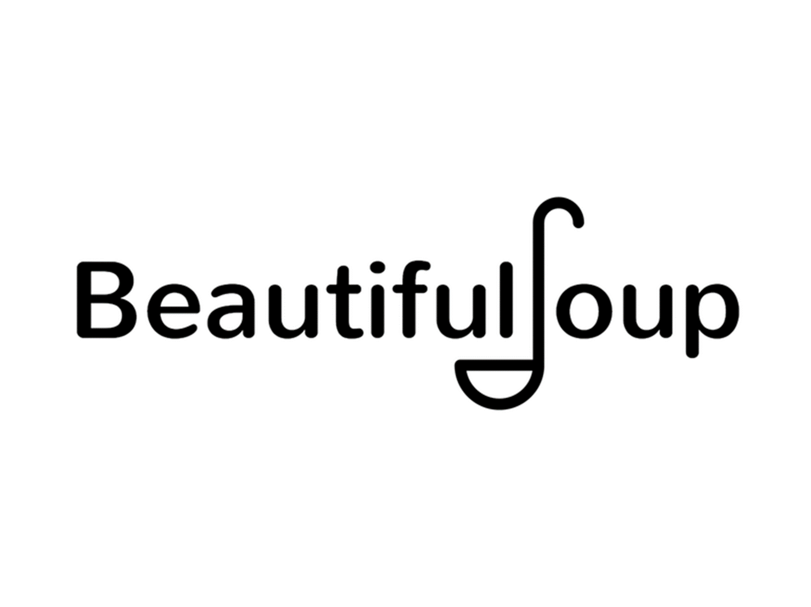
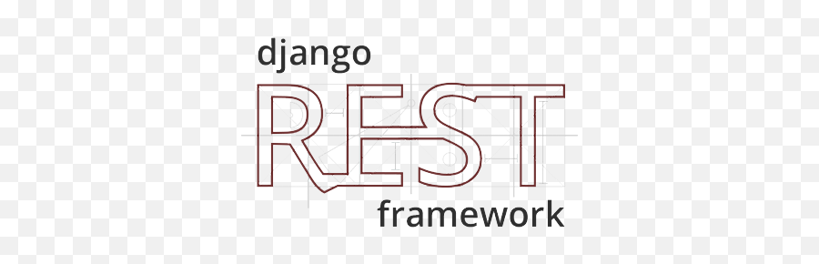

  

<h3> 👩‍💻 Sofiya Chobanyan | 💻 Web Scraping and Back End Developer | 📍 Yerevan, Armenia </h3>

### ⚙️ Some Tool and Tech I use

<code></code>
<code></code>
<code></code>
<code></code>
  <code></code>
<code></code>
<code></code>
<code></code>
<code></code>
<code></code>
<code></code>
<code></code>
<code></code>
<!--
**Sofiyayan/Sofiyayan** is a ✨ _special_ ✨ repository because its `README.md` (this file) appears on your GitHub profile.

Here are some ideas to get you started:

- 🔭 I’m currently working on ...
- 🌱 I’m currently learning ...
- 👯 I’m looking to collaborate on ...
- 🤔 I’m looking for help with ...
- 💬 Ask me about ...
- 📫 How to reach me: ...
- 😄 Pronouns: ...
- ⚡ Fun fact: ...
-->
